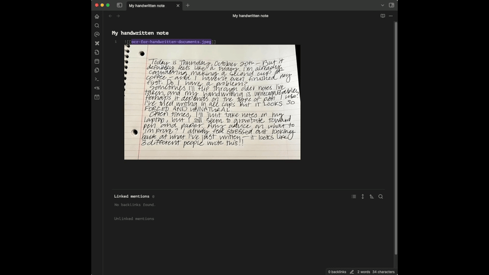

# Handwriting OCR Plugin for Obsidian

Transform handwritten documents and scanned images into editable text with [HandwritingOCR](https://www.handwritingocr.com)'s AI-powered handwriting to text conversion. Perfect for digitizing handwritten notes, converting legacy documents, and making your analog content searchable within Obsidian.

Extract text directly to your clipboard, create new notes with formatted content, or append OCR results to your existing notes. Supports PDFs and common image formats.

## Plugin Demo


## Features

- Extract text from images (JPG, PNG, GIF, BMP, TIFF, HEIC, WEBP) and PDFs
- Superior handwriting recognition compared to standard OCR (and great for printed text too!)
- Simple integration with Obsidian's UI:
  - Right-click menu on supported files
  - Command palette commands
  - Replace or append extracted text
- API key validation with credit balance display
- Support for files up to 20MB

## Setup

1. Install the plugin
2. Get your API key from [handwritingocr.com](https://www.handwritingocr.com/settings/api).
3. Enter your API key in the plugin settings
4. Click "Validate" to check your key and view remaining credits

## Usage

### From Editor
1. Insert an image or PDF link in your note (e.g., `![[document.pdf]]`)
2. Select the link
3. Use one of these methods:
   - Command palette: "Handwriting OCR: Replace selection" or "Append to selection"
   - Right-click → "Handwriting OCR" → Choose action

### From File Explorer
1. Right-click on any supported image or PDF file
2. Select "Handwriting OCR" → Choose action:
   - "Extract text to clipboard"
   - "Extract to new note"

## Supported File Types

- Images: JPG, JPEG, PNG, GIF, BMP, TIFF, TIF, HEIC, WEBP
- Documents: PDF
- Maximum file size: 20MB

## Credits

Each page processed consumes one credit from your Handwriting OCR account. Multi-page PDFs consume multiple credits. Please note that HandwritingOCR is a paid service that requires the creation of a user account. However, the free trial credits you receive when creating an account will provide you with full access to the service so you can decide whether it is of use to you.

## Development

```bash
# Install dependencies
npm install

# Build for development
npm run dev

# Build for production
npm run build
```

## License

MIT
